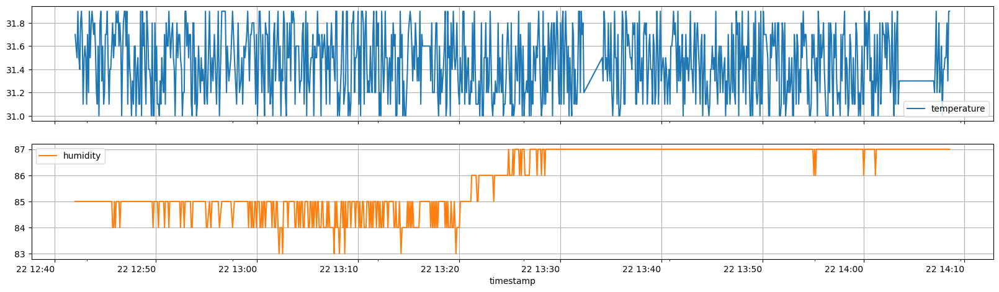
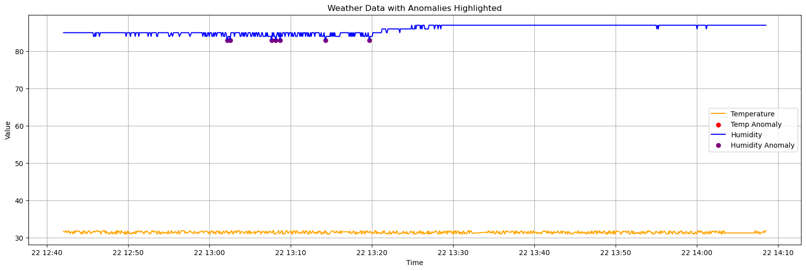
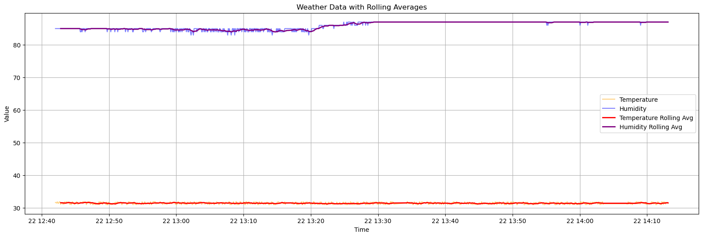
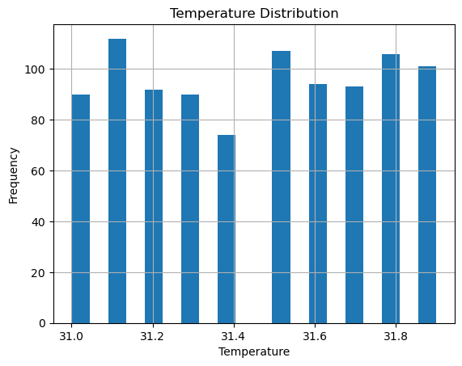
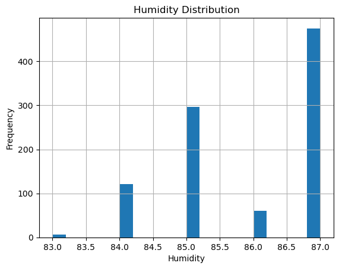

# Nimbus

This is a simple weather station project that collects temperature and humidity data using an ESP32 microcontroller and visualizes the data using Python.

## Components Used

- ESP32 microcontroller
- DHT11 temperature and humidity sensor

## Connect the DHT11 Sensor to ESP32

1. Connect the VCC pin of the DHT11 sensor to the 3.3V pin on the ESP32.
2. Connect the GND pin of the DHT11 sensor to a GND pin on the ESP32.
3. Connect the DATA pin of the DHT11 sensor to GPIO4 on the ESP32.

## Setup Instructions

1. Install the required libraries for ESP32:
   - `esp32` board support in Arduino IDE
   - `DHTesp` library

2. Upload the `server.ino` code to your ESP32 using the Arduino IDE.

3. Scraper Script:
   - Make sure you have Python installed on your machine.
   - Install the required Python libraries:
     ```
     pip install requests matplotlib pandas
     ```
   - Run the `scrapper.py` script to start collecting data from the ESP32.

4. Visualization:
   - Open the `visualize.ipynb` notebook in Jupyter Notebook or JupyterLab.
   - Run the cells to visualize the collected data.


5. Note: Ensure that the ESP32 is connected to the same network as the machine running the Python script.
   

## Example Output









